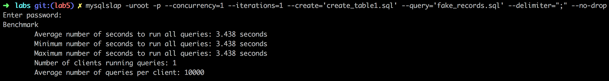
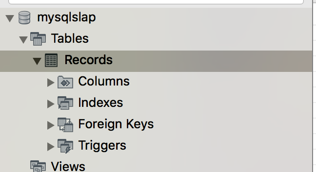
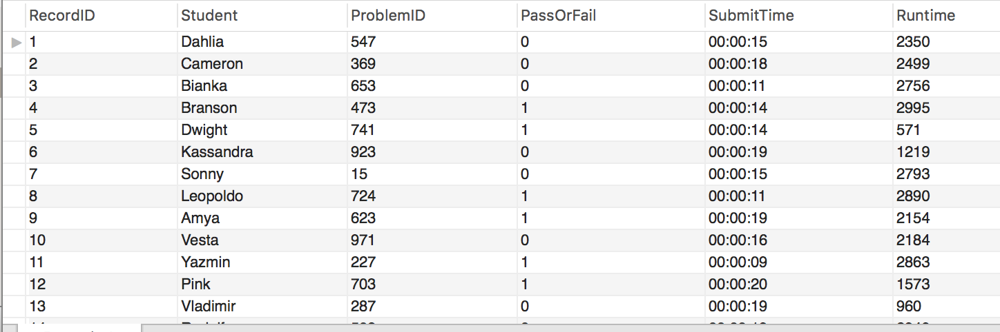
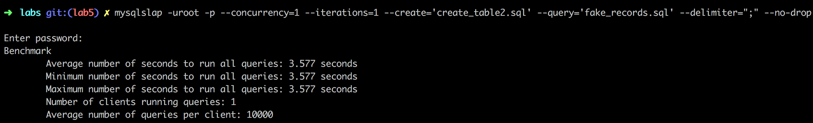

## lab 5 Report

### Create table 1
`mysqlslap -uroot -p --concurrency=1 --iterations=1 --create='create_table1.sql' --query='fake_records.sql' --delimiter=";" --no-drop`

`mysqlslap -uroot -p --concurrency=1 --iterations=1 --create='create_table2.sql' --query='fake_records.sql' --delimiter=";" --no-drop`

